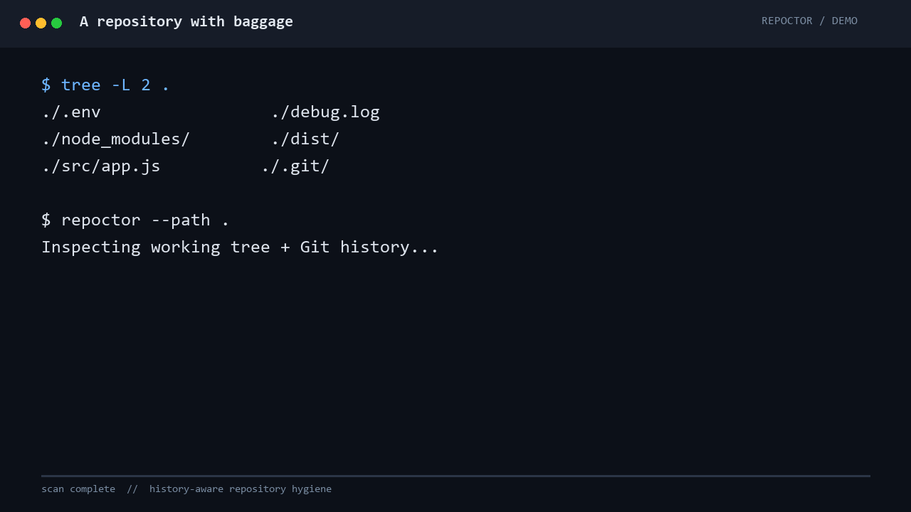

# repoctor

> One command to find secrets, 50MB blobs, and stale junk in your git repos.

`repoctor` is a single static binary that reads a repository — the working tree
*and* the whole of its git history — and prints what a reviewer would flag:
credentials that were committed, files that will bloat every clone forever,
branches nobody has touched in half a year, and dependencies pinned to versions
with published CVEs. No config file, no rules to write, no daemon.



The demo runs the real scanner against a temporary repository containing a
tracked `.env`, an unignored `node_modules/`, a `dist/` directory, and a log
file. The fixture is temporary and is never part of the repository being
scanned.

## Quick start

```bash
repoctor --path .
```

Use `--json` when another tool or a CI job needs to consume the report:

```bash
repoctor --json > findings.json
```

## Install

Pre-built binaries for Linux, macOS and Windows (amd64 and arm64) are attached
to every release:

**[→ Download from GitHub Releases](https://github.com/me-intenzo/repoctor/releases/latest)**

Linux and macOS archives are `.tar.gz`, Windows is `.zip`. After downloading the
archive for your platform:

```bash
tar -xzf repoctor_*.tar.gz repoctor
sudo install repoctor /usr/local/bin/repoctor
repoctor -version
```

Or build from source, which needs Go 1.27.1 or newer:

```bash
go install github.com/me-intenzo/repoctor@latest
```

A Homebrew tap is planned; for now the releases page is the supported path.

## Sample output

```text
[CRITICAL] [env-files] committed environment file: .env
  fix: add to .gitignore and remove from history: git rm --cached '.env'
[WARNING] [gitignore] node_modules/ exists in the repo but .gitignore does not ignore it
  fix: add "node_modules/" to .gitignore
[WARNING] [gitignore] *.log exists in the repo but .gitignore does not ignore it
  fix: add "*.log" to .gitignore
[WARNING] [gitignore] dist/ exists in the repo but .gitignore does not ignore it
  fix: add "dist/" to .gitignore

4 findings
```

## Usage

Scan the repository in the current directory:

```bash
repoctor
```

| Flag | Default | Description |
| --- | --- | --- |
| `-path` | `.` | Repository to scan. |
| `-json` | `false` | Emit findings as a JSON array instead of the text report. |
| `-version` | | Print the version and exit. |

Single and double dashes both work, so `-json` and `--json` are the same flag.

```bash
repoctor --path ../some-other-repo
repoctor --json > findings.json
```

### Exit codes

| Code | Meaning |
| --- | --- |
| `0` | No critical findings. Warnings and info notes may still be printed. |
| `1` | At least one **critical** finding: a committed secret, an env file in the index, or a blob over 50 MB. |
| `2` | A check could not run — usually `git` is missing, or the path is not a repository. The failure is also reported as a finding with severity `error`. |

That split is what makes it usable in CI: criticals break the build, everything
else is reported without failing it.

### JSON output

`--json` prints one array of findings, which is easy to filter with `jq`:

```json
[
  {
    "severity": "critical",
    "check": "env-files",
    "message": "committed environment file: .env",
    "fix": "add to .gitignore and remove from history: git rm --cached '.env'"
  }
]
```

```bash
# just the criticals
repoctor --json | jq '[.[] | select(.severity == "critical")]'
```

### In CI

```yaml
name: repo hygiene

on: [push, pull_request]

jobs:
  repoctor:
    runs-on: ubuntu-latest
    steps:
      - uses: actions/checkout@v4
        with:
          # repoctor reads history — a shallow clone hides old blobs and secrets
          fetch-depth: 0

      - uses: actions/setup-go@v5
        with:
          go-version: '1.27.1'

      - run: go install github.com/me-intenzo/repoctor@latest

      # exits 1 on any critical finding, which fails the job
      - run: repoctor

      - name: Upload report
        if: always()
        run: repoctor --json > repoctor.json || true
      - uses: actions/upload-artifact@v4
        if: always()
        with:
          name: repoctor-report
          path: repoctor.json
```

`fetch-depth: 0` matters. The `secrets` and `big-blobs` checks walk
`git rev-list --objects --all`; with the default shallow, single-branch checkout
there is almost no history to walk and both checks will look suspiciously clean.

## Checks

Six checks run on every invocation, in this order:

| Check | What it looks for | Severity |
| --- | --- | --- |
| `env-files` | `.env` and `.env.*` files that git actually tracks. A `.env` sitting ignored in your working tree is fine and is not reported; `.env.example` and `.env.sample` are templates and are skipped. | `critical` |
| `gitignore` | `node_modules/`, `__pycache__/`, `dist/` or `*.log` present in the repo while the root `.gitignore` does not cover them. Understands anchoring and `!` negation, so a real ignore rule is not reported as a gap. | `warning` |
| `big-blobs` | Blobs of 5 MB or more anywhere in history, including files that were deleted years ago — they are still in every clone. Each path is reported once, at its largest revision. | `warning`, `critical` at 50 MB |
| `secrets` | AWS access key IDs, GitHub personal access tokens, and PEM private key blocks, across every text blob under 2 MB in history. Reports the file and the commit that introduced it, and never echoes the credential itself. | `critical` |
| `stale-branches` | Local and remote-tracking branches with no commit in 180 days. The checked-out branch is never flagged. | `info` |
| `deps` | Exact versions pinned in `package-lock.json` (v1, v2 and v3) and `go.mod`, matched against a curated list of well-known CVEs. `go.mod` `replace` directives are resolved first, and anything that cannot be ordered confidently — a git hash, a range, a Go pseudo-version — is skipped rather than guessed at. | `warning` |

Every finding carries a `fix` string — the actual command to run, with paths
shell-quoted so you can paste it.

For the two checks that would otherwise shout — `env-files` and `secrets` —
findings under `test/`, `tests/`, `testdata/`, `fixtures/`, `__tests__/`,
`examples/` and similar paths are downgraded to `info` rather than dropped, and
so do not fail CI. A fake key in a test fixture is not an incident, but it is
still worth seeing.

## Why not Gitleaks or TruffleHog?

Use them. They are better at secret scanning than `repoctor` will ever be, and
this is not an attempt to replace them.

The difference is shape. Gitleaks and TruffleHog do **one** check deeply.
`repoctor` does **six** checks shallowly, in one command, with no configuration.

| | repoctor | Gitleaks / TruffleHog |
| --- | --- | --- |
| Secret detection rules | 3 patterns | 150+ (Gitleaks), 800+ detectors (TruffleHog) |
| Entropy analysis | ✗ | ✓ |
| Verifies a key is still live | ✗ | ✓ (TruffleHog) |
| Custom rules, baselines, allowlists | ✗ | ✓ |
| Large files in history | ✓ | ✗ |
| Stale branches | ✓ | ✗ |
| `.gitignore` gaps | ✓ | ✗ |
| Dependency CVEs | ✓ | ✗ |
| Configuration required | none | rules / baseline files |

So: if you want to know whether a credential ever entered your history, run a
dedicated scanner and tune it. If you want to know what shape a repo is in
before you inherit it — or before it becomes public — run `repoctor` once and
read fifteen lines.

The honest caveats:

- Three secret patterns will miss most secret formats. A clean `secrets` result
  means "none of those three patterns matched", not "there are no secrets".
- The CVE list is hand-curated and deliberately small. It is not a substitute
  for `npm audit`, `govulncheck`, or Dependabot.
- Only the root `.gitignore` is read; nested `.gitignore` files are not merged.

## License

[MIT](LICENSE) © Nagesh Tiwari

## Contributing

Issues and pull requests are welcome.

```bash
git clone https://github.com/me-intenzo/repoctor
cd repoctor
go test ./...
go vet ./...
go build -o repoctor .
```

A new check is a type in [internal/checks/](internal/checks/) implementing the
`Check` interface, added to `All()` in
[internal/checks/checks.go](internal/checks/checks.go):

```go
type Check interface {
	Name() string
	Run(repoPath string, inventory *gitutil.Inventory) ([]Finding, error)
}
```

Two conventions worth keeping: a check returns an error only when it could not
*run* (which is not the same as finding nothing), and every finding it emits
carries a `Fix` the user can paste into a shell.
